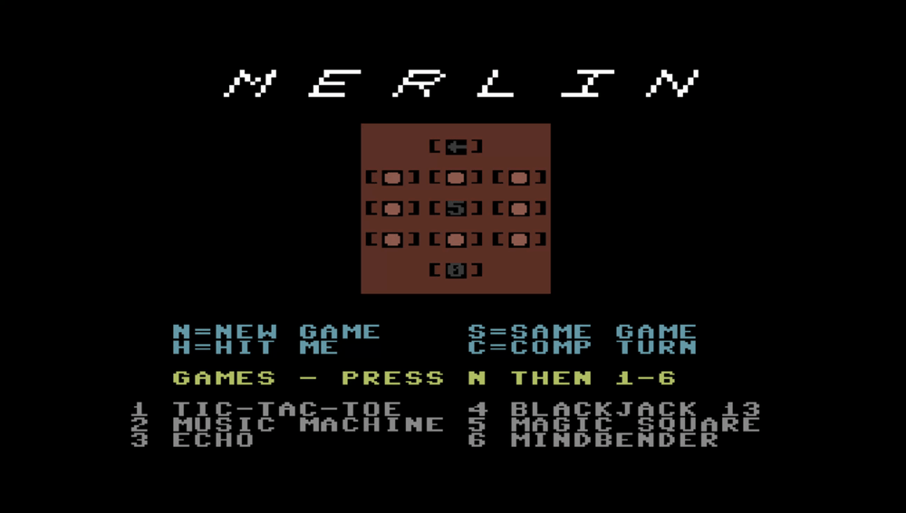
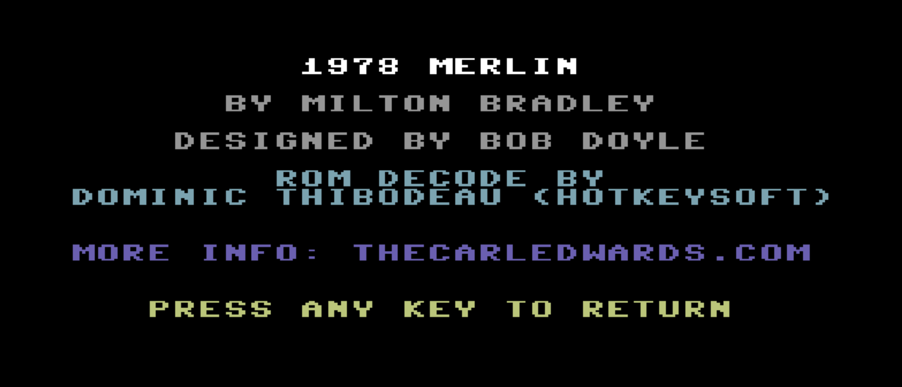

# Merlin on the Commodore 64

In 1978, Milton Bradley sold a handheld toy called **Merlin** — a red
wand with eleven light-up buttons that played six little games:
tic-tac-toe, a memory game, a tone-matching game, blackjack, and a couple
of others. Inside was a single chip: a Texas Instruments TMS1100, a tiny
4-bit microcontroller running one 2 KB program burned into silicon.

This project runs that **exact original chip program on a Commodore 64** —
it is not a remake. The C64 *pretends to be the TMS1100*: it emulates the
4-bit processor one instruction at a time and feeds it the real Merlin
ROM. So every game, every blinking-light pattern, and every beep you get
is the genuine 1978 article — just played out on a C64's screen, keyboard,
and SID chip instead of the original plastic wand.



## Playing it

```
   key            pad
   LEFT-ARROW      0     (top single)
   1 2 3           1 2 3
   4 5 6           4 5 6   (the 3x3 grid)
   7 8 9           7 8 9
   0              10     (bottom single)

   N = New Game   S = Same Game   H = Hit Me   C = Comp Turn
```

The lit pads on screen are Merlin's buttons; you press the matching key.
Press **N** for a new game, then a number **1–6** to choose one of the six
games. Press any *other* key for the credits screen.

## Heads-up: it runs in slow motion

You'll notice Merlin feels sluggish, so it's worth explaining up front —
it's not a bug, it's physics.

The TMS1100 inside the real toy ran at about **350 kHz**. The C64's 6502
is faster on paper (~1 MHz), but it *isn't* a TMS1100 — so it has to fake
one, spending roughly **30 of its own instructions to carry out a single
one of Merlin's**. The net effect is that the whole thing runs about **6×
slower than the real toy** (~100 C64 cycles per Merlin instruction; ~10,000
Merlin instructions/second here versus ~58,000 on real hardware).

The interpreter's inner loop is tuned about as far as it'll go on a 1 MHz
machine, but you can't out-engineer that gap: a general-purpose CPU
emulating a *different* CPU is always going to be slower than the chip it's
imitating. In practice, tic-tac-toe plays fine; the timing/music games and
the live sound effects drag. (The startup jingle is the exception — it's
pre-recorded and plays at full speed; see [Sound](#sound).)

That trade — the real chip, the real ROM, honest emulation, at the cost of
speed — is kind of the whole point.

> **Want Merlin at full speed?** The same emulator core runs in your
> browser (WebAssembly, no slowdown) — play it here:
> **<https://carledwards.github.io/lets-go-merlin/>**

## Touches that make it feel like Merlin

- **Self-documenting keypad.** Each unlit pad shows the key that presses
  it (`←`, `1`–`9`, `0`); a pad lights up as a red ball, on a red faceplate
  like the original toy.
- **Title shimmer.** While idle, a colour wave (white → yellow → orange →
  red) sweeps the MERLIN letters every few seconds — they're six hardware
  sprites, italicised by shifting each pixel row.
- **Keyboard that doesn't miss taps.** Because the ROM debounces keys by
  counting its own (slow) instructions, a quick tap is briefly held "down"
  so it always registers.
- **Credits screen** — press any non-Merlin key:



## Sound

Merlin has no sound chip — the TMS1100 makes tones by toggling one pin as
a square wave. We rebuild that on the SID. Because of the 6× slowdown,
playing the pin back directly gives the *right pitch but a drawn-out
tempo*. So for fixed tunes (the startup jingle) we instead detect the sound
starting and play a pre-recorded SID version at full speed; everything else
falls back to the live, pitch-correct-but-slow path. The full story —
including why the in-game sounds *can't* be pre-recorded — is in
[`docs/AUDIO.md`](docs/AUDIO.md).

## Under the hood (for the curious)

- **`merlin.s`** — the whole C64 program: a BASIC `SYS` stub, the TMS1100
  interpreter (zero-page registers, a 128-way opcode dispatch, the ROM's
  quirky LFSR program counter), the keyboard scan, the screen, and the SID
  audio. The interpreter is a line-for-line port of the
  [`lets-go-merlin`](https://github.com/carledwards/lets-go-merlin) Go core.
- **`gen/`, `romgen/`, `sprites/`, `siddata/`, `songgen/`** — build-time Go
  helpers. They unscramble the ROM, draw the title sprites, build the
  pitch table, and transcribe the jingle. The raw Merlin ROM is pulled from
  the `lets-go-merlin` module and is never committed here.
- **`lockstep/`** — the part I'm proud of. It assembles `merlin.s`, runs it
  on a neutral 6502 emulator, and compares the interpreter's state against
  the trusted Go core **after every single TMS1100 instruction** — every
  register and every LED line must match, for millions of instructions.
  That's how we know the C64 is running Merlin *correctly*, not just
  approximately.
- **`soundcap/`** — a tool that prints Merlin's sound "catalogue" (pitches,
  durations, and which ROM routine made each one), used to design the audio.

## Build & run

**▶ Just want to play it?** Grab a ready-to-run `merlin.prg` from the
[Releases](../../releases) page — no toolchain needed. Load it on a real
C64, in [VICE](https://vice-emu.sourceforge.io/), or on an Ultimate.

To build it yourself:

```sh
make            # builds merlin.prg
make test       # lockstep check against the Go reference
```

Then on an Ultimate 64 / Ultimate-II+ (via
[u64ctl](https://github.com/carledwards/u64ctl)):

```sh
u64ctl run merlin.prg
```

…or on any emulator (e.g. VICE) or real C64: `LOAD"MERLIN.PRG",8,1`, then
`RUN`.

This is a standalone Go module that builds Merlin with the
[go6asm](https://github.com/carledwards/go6asm) 6502 assembler. It depends
on `go6asm` and `lets-go-merlin` by version; to hack on all three at once,
add them to a local `go.work`.

## Credits & lineage

- **Merlin** (1978) — Milton Bradley, designed by **Bob Doyle**.
- The TMS-family ROM-decode work this lineage descends from is by
  **Dominic Thibodeau (hotkeysoft)**, whose C++ emulator started it all.
- [`lets-go-merlin`](https://github.com/carledwards/lets-go-merlin) — the
  Go TMS1100 core this port mirrors and tests against; also a
  [full-speed browser version](https://carledwards.github.io/lets-go-merlin/).
- More info: **thecarledwards.com**
